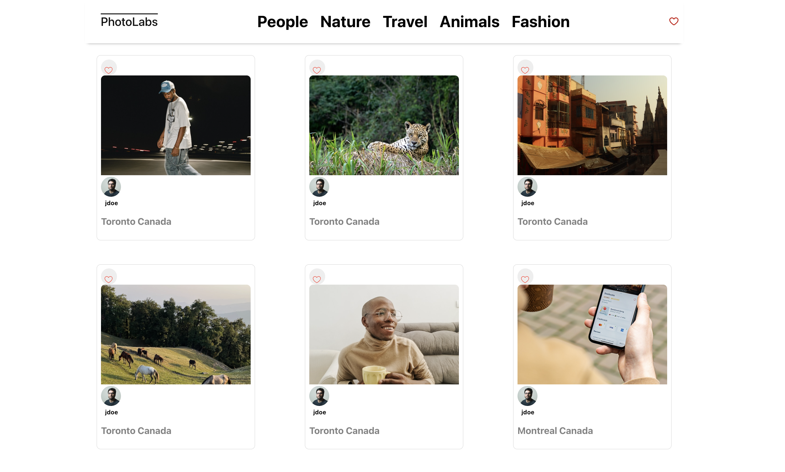
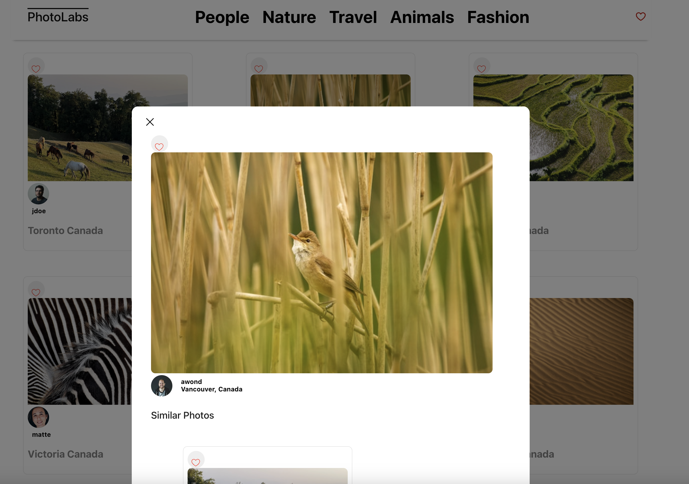
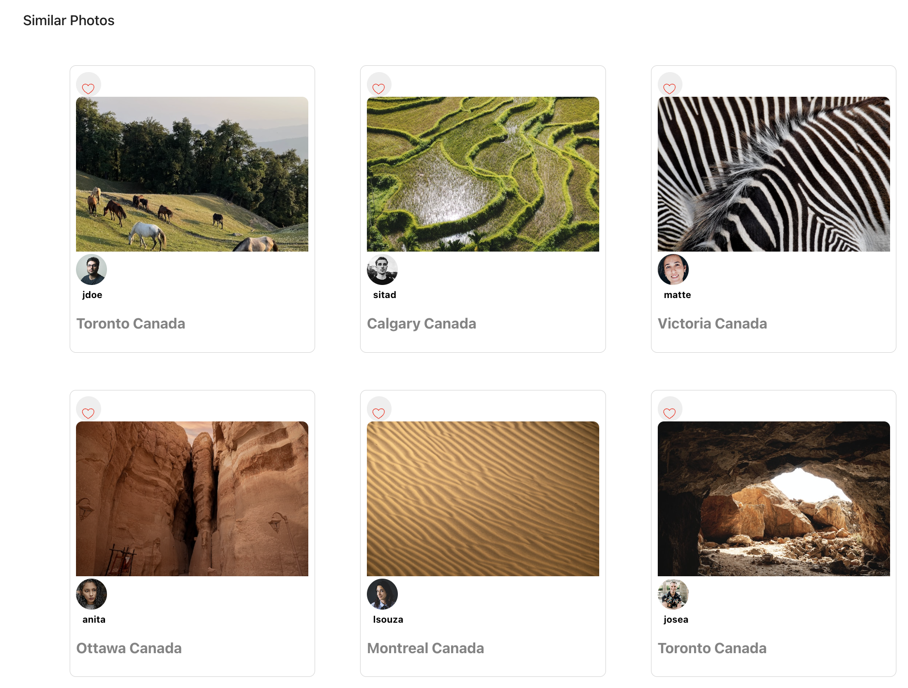

# react-photolabs

This project is for my Web Development Bootcamp at lighthouse labs and it not intended to be used in production. This project demonstrates the use of state to managment components in a web app. 

# Photolabs

Photo labs allows users to view photos organized by topic. Key Functionality:
- Loads a list of photos from an API
- Allows users to view an enlarged version of any given photo, as well as displaying a list of similar photos
- Allows users to "favourite" photos
- Allows users to filter photos by topics in top navigation

# Screenshots






## Setup

Install dependencies with `npm install` in each respective `/frontend` and `/backend`.


## [Frontend] Running Webpack Development Server

```sh
cd frontend
npm start
```

## Front End Dependencies


## [Backend] Running Backend Servier

Read `backend/readme` for further setup details.

```sh
cd backend
npm start
```
## Back End Dependencies

    "body-parser": "^1.18.3",
    "cors": "^2.8.5",
    "dotenv": "^7.0.0",
    "express": "^4.16.4",
    "helmet": "^3.18.0",
    "pg": "^8.5.0",
    "socket.io": "^2.2.0",
    "ws": "^7.0.0"
    "jest": "^24.8.0",
    "supertest": "^4.0.2"